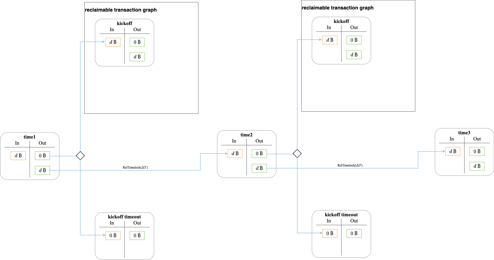

# Key Factors to Consider for Reusable Collateral
Reusable collateral could be one of the most valuable enhancements to the BitVM bridge. By significantly improving capital efficiency, it allows multiple reclaims to share the same deposit. In that case, the operator is not required to prepare separate UTXOs for each individual reclaim, resulting in substantial cost savings.

It introduces a new feature that the `time` transaction is linked to the `kickoff` transaction of each reclaimable transaction graph. This means the operator can only initiate a reclaim in the order dictated by the sequence of `time` transactions. But only one operator can submit pegout successfully each round, others have to wait for a certain period to enter next relcaim

However, some challenges still need to be addressed for this new feature.
1. If the `reclaimable transaction graph` is invalid, such as the related `Pegin` was not submitted to the bitcoin. It will have stronger impact on other reclaims compare to disable reusable collateral. Subsequent transactions will be affected by this issue. Even if the `reclaimable transaction graph` is invalid, the following `time` transactions must still wait for the corresponding timeout period($\Delta T$) to expire before they can be initiated. 
2. To enhance the convenience and flexibility of withdrawals, the `reclaimbale utxo` the UTXO received by the operator after the reclaim process should ideally have varying denominations, such as 1 BTC, 2 BTC, or 5 BTC, and so forth. However, it is inherently challenging for the operator to predict which denomination a user might choose to utilize. This unpredictability makes it difficult for the operator to arrange the sequence of `reclaimable UTXOs` in a logical or optimal order. As a result, users are left with no alternative but to accept the `reclaimable UTXO` that the operator is capable of processing at that particular point in the sequence. This limitation restricts user flexibility and could lead to inefficiencies in the withdrawal process.
3. Apparently, the reclaim process can only be handled sequentially, which significantly hampers the efficiency of the reclaim. if the the $\Delta T = 7 days$. then only 52 reclaim( 365days / 7)  can be processed per year

Potentially, there are three solutions to address these issues.
1. During the `pegin` stage, operators should make sure that every `reclaimable transaction graph` is valid. Specifically, only after the `pegin` transaction has been submitted to the bitcoin mainet successfully then they store corresponding `reclaimable transaction graph` and then will handle the next `pegin` request.
2. For each denominations, a seperate `time` transacion sequence should be arranged, allowing operators to process reclaim parallel. Users can freely choose any denomination for withdrawal according to their preferences. Besides, it also improves the efficiency of reclaim.
3. In order to accelerate the process of `pegin` and `reclaim`. a operator pool can also be established. for every `pegin` request. a sufficient number of operartors should be selected to participate in the processing. if there are two concurrent `pegin` request, different groups of operators can be assigned to handle these requests simultaneously. During the reclaim process, these requests can also be handled in parallel since they belong to different groups.